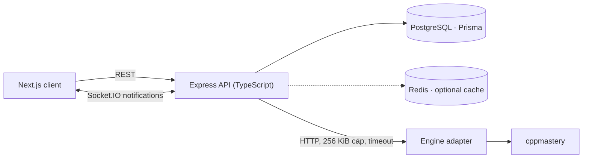

<div align="center">

# C++ Mastery Hub

**A C++ learning platform built around a dependency-free, verified static-analysis engine.**

Learners write C++ in the browser and get diagnostics that cite the guideline they enforce,
classical software metrics with documented formulas, and a memory-layout view that shows padding
and a provably optimal field order. The platform never executes submitted code.

[](https://github.com/SatvikPraveen/Cpp-Mastery-Hub/actions/workflows/engine.yml)
[](https://github.com/SatvikPraveen/Cpp-Mastery-Hub/actions/workflows/web.yml)
[](https://github.com/SatvikPraveen/Cpp-Mastery-Hub/actions/workflows/codeql.yml)
[](https://github.com/SatvikPraveen/Cpp-Mastery-Hub/actions/workflows/docker.yml)
[](LICENSE)


[Quick start](#quick-start) · [The engine](#the-analysis-engine) · [The platform](#the-platform) ·
[Verification](#verification) · [Research documentation](#research-documentation) · [Citing](#citing)

</div>

---

## Why this project

Most "learn C++" tools either run code in a sandbox they cannot fully trust, or wrap a large
compiler front end whose output learners cannot interpret. This project takes a different
position:

- **Analysis, not execution.** Feedback comes from a static-analysis engine that is total over
  arbitrary input (property-tested and fuzzed), so the attack surface for untrusted code is a
  tokenizer, not a compiler and a container runtime.
- **Every judgement is citable.** Each of the 20 rules names the C++ Core Guidelines item, CERT
  rule, CWE or paper that motivates it, and every metric's formula and operationalisation is
  written down, including the choices where tools usually disagree silently.
- **Claims are checked by code.** Recall on a seeded corpus, the optimality of layout
  reordering, schema conformance and the end-to-end learner journey are all executed in CI.

## Quick start

```bash
git clone https://github.com/SatvikPraveen/Cpp-Mastery-Hub.git && cd Cpp-Mastery-Hub
cp .env.example .env            # set the four secrets: openssl rand -hex 32
docker compose up -d --build    # postgres, redis, engine, migrations + seed, backend, frontend, nginx
```

Open http://localhost:3000, or http://localhost:8080 for the single-origin nginx entry point.
The seed provides a course with lessons, a quiz and an exercise; register an account to start.
Native development, the test commands and troubleshooting are covered in
[docs/user-guides/getting-started.md](docs/user-guides/getting-started.md).

Only want the analyser?

```bash
cd cpp-engine && cmake --workflow --preset dev      # builds and runs 70 tests in seconds
./build/dev/cppmastery analyze your_file.cpp
```

## The analysis engine

`cpp-engine/` is a C++20 library and CLI with **no third-party runtime dependencies**. It builds
in seconds on GCC, Clang and AppleClang and ships as a single static binary.

```text
$ cppmastery analyze demo.cpp
demo.cpp:3:1: warning: 'using namespace std;' at file scope. [readability/using-namespace-std]
    hint: Qualify names (std::cout) or scope the directive to a function.
demo.cpp:7:5: error: Call to unsafe C function 'strcpy'. [security/unsafe-c-function]
    hint: Prefer std::string / std::string_view, std::snprintf, std::strtok_r or std::array with bounds checks.
demo.cpp:8:19: warning: Raw 'new' expression. [memory/raw-new-delete]
    hint: Prefer std::make_unique / std::make_shared or a container.
...
1 error(s), 3 warning(s), 1 info(s) from 20 rules in 131 us
halstead volume 220.9, effort 2061.9; maintainability 105.4 (normalized 61.6)
```

```text
$ cppmastery layout particle.hpp
struct Particle: sizeof=40 alignof=8 padding=10 (25%)
  +0  bool active  (1 bytes, align 1)
    [7 byte(s) padding]
  +8  double x  (8 bytes, align 8)
  ...
  reorder to save 8 byte(s): x y z id active tag  -> sizeof=32
```

| Component | What it does |
|---|---|
| **Lexer** | Single-pass, total C++20 tokenizer: raw strings with delimiters, digit separators, hex floats, UD-literals, longest-match punctuators. Any byte sequence tokenises, and tokens cover the input exactly once. |
| **Metrics** | Line classes, Halstead measures, McCabe and extended cyclomatic complexity per function, nesting depth, Maintainability Index (SEI raw, normalised, comment-weighted). |
| **Rule engine** | 20 rules across security, memory, correctness, modernisation, readability, performance, portability and complexity, each with a reference and documented precision trade-offs. Thresholds and rules are configurable. |
| **Memory layout** | Itanium-ABI offsets and padding for LP64, LLP64 and ILP32, `#pragma pack` emulation, and a field reordering proved size-optimal. |
| **Interfaces** | CLI with CI-friendly exit codes; versioned JSON validated by JSON Schema; a stateless HTTP adapter for the platform. |

Measured on the seeded evaluation corpus and synthetic benchmarks
([full report](docs/research/results/results.md)):

| Measure | Result |
|---|---|
| Seeded-smell recall | 21 / 21 expected diagnostics |
| Warnings or errors on idiomatic clean code | 0 |
| Layout suggestions larger than the original | 0 (also fuzzed) |
| Tokenizer throughput | ≈ 95–160 MB/s, single thread |
| Full analysis (lex + metrics + 20 rules) | ≈ 30–40 MB/s, single thread |

Benchmarks ran on an Apple-silicon laptop under heavy unrelated load; CI publishes a fresh report
for every commit as a build artifact.

## The platform


```mermaid
flowchart LR
    UI["Next.js client"] -- REST --> API["Express API (TypeScript)"]
    UI <-- "Socket.IO notifications" --> API
    API --> PG[("PostgreSQL · Prisma")]
    API -.-> RD[("Redis · optional cache")]
    API -- "HTTP, 256 KiB cap, timeout" --> AD["Engine adapter"] --> CLI["cppmastery"]
```

| Area | Capabilities |
|---|---|
| **Editor** | Monaco editor, engine-backed diagnostics and metrics, memory-layout view, starter templates, snippets with visibility and idempotent likes |
| **Learning** | Courses, lessons and exercises; exact progress tracking; quizzes graded on the server without ever sending answer keys; static feedback on exercise submissions; next-course recommendations from a transparent, prerequisite-aware ranker that explains each suggestion |
| **Community** | Forum with categories, threaded comments, likes, reports and moderation, plus a contribution leaderboard computed in SQL |
| **Accounts** | Session-bound tokens with refresh rotation and reuse detection, email verification, single-use password reset, role-based administration |
| **Notifications** | Persistent, with real-time delivery on lesson completion and forum replies |

**Deliberately not implemented.** Running programs (the API answers `501` until a sandbox meeting
the [threat model](docs/research/threat-model.md) exists), live collaborative editing and OAuth
sign-in. Their UI is behind `NEXT_PUBLIC_ENABLE_*` flags that default to off.

The full HTTP contract is in [docs/api/README.md](docs/api/README.md), and the design in
[docs/architecture/README.md](docs/architecture/README.md).

## Verification

| Layer | What runs | Where |
|---|---|---|
| Engine | 70 tests (58 unit, 4 property, CLI and adapter end-to-end) on GCC 12/13, Clang 18, AppleClang | `engine` workflow |
| Memory safety | Full engine suite under AddressSanitizer and UndefinedBehaviorSanitizer | `engine` workflow |
| Fuzzing | libFuzzer on the lexer, analyser and layout model with invariant aborts; it found one real bug, now fixed and kept as a regression test | `engine` workflow |
| Static analysis | Gating clang-tidy profile, `-Werror` with an extensive warning set, clang-format, CodeQL for C++ and TypeScript | `engine`, `codeql` workflows |
| Evaluation | Seeded-smell recall, clean-corpus precision, layout soundness, JSON-schema validation, benchmarks | `cpp-engine/eval/run_eval.py` |
| Backend | Strict TypeScript, ESLint, 64 unit, integration and engine-contract tests | `web` workflow |
| End to end | Learner journey on PostgreSQL 16 with the real engine, plus a schema-drift check | `web` workflow (e2e) |
| Frontend | Strict TypeScript, `next lint`, 25 tests, production build | `web` workflow |
| Images | Engine image runs its test suite during `docker build`; web images are built and smoke-tested | `docker` workflow |

Notable defects these checks caught are recorded in the [changelog](CHANGELOG.md). Examples
include refresh tokens signed with the access secret, sessions that survived password changes, a
PostgreSQL transaction-abort bug invisible to mocks, and core sources silently excluded by
`.gitignore`.

## Research documentation

| Document | Contents |
|---|---|
| [Metrics methodology](docs/research/metrics-methodology.md) | Every reported number, its formula and origin, and the engine's operationalisation choices |
| [Rule catalogue](docs/research/rule-catalog.md) | All 20 rules with references, detection logic and precision notes |
| [Memory-layout model](docs/research/memory-layout-model.md) | Layout algorithm, data models, optimality proof and the fuzzer-found counterexample to its first implementation |
| [Threat model](docs/research/threat-model.md) | Assets, trust boundaries, and implemented versus required controls |
| [Evaluation protocol](docs/research/evaluation.md) | Corpus design, measures, reproduction steps and threats to validity |
| [Architecture decisions](docs/adr/README.md) | ADR-0001 to ADR-0007 |

## Repository layout

```text
cpp-engine/        C++20 analysis library, CLI, HTTP adapter, tests, fuzzers, benchmarks, evaluation
backend/           Express + TypeScript API, Prisma schema, migrations, seed, tests
frontend/          Next.js 14 client
docs/              API reference, architecture, research notes, ADRs, user guide
docker/            nginx configuration
docker-compose*.yml  local stack, development infrastructure, production deployment
.github/           CI workflows, Dependabot, issue and PR templates
```

## Contributing

Contributions are welcome. [CONTRIBUTING.md](CONTRIBUTING.md) covers the build, the test
commands, the rule-proposal process (every rule needs a citation and must-flag and must-not-flag
examples), and the commit conventions. Security issues go through [SECURITY.md](SECURITY.md),
not public issues.

## Citing

If you use the engine, its metric definitions or the evaluation corpus in academic work, please
cite it using [CITATION.cff](CITATION.cff) (GitHub's *Cite this repository* button), or:

```bibtex
@software{praveen_cpp_mastery_hub,
  author  = {Praveen, Satvik},
  title   = {C++ Mastery Hub: a dependency-free C++ analysis engine and learning platform},
  url     = {https://github.com/SatvikPraveen/Cpp-Mastery-Hub},
  version = {2.0.0},
  license = {MIT}
}
```

## License

[MIT](LICENSE) © 2025–2026 Satvik Praveen
