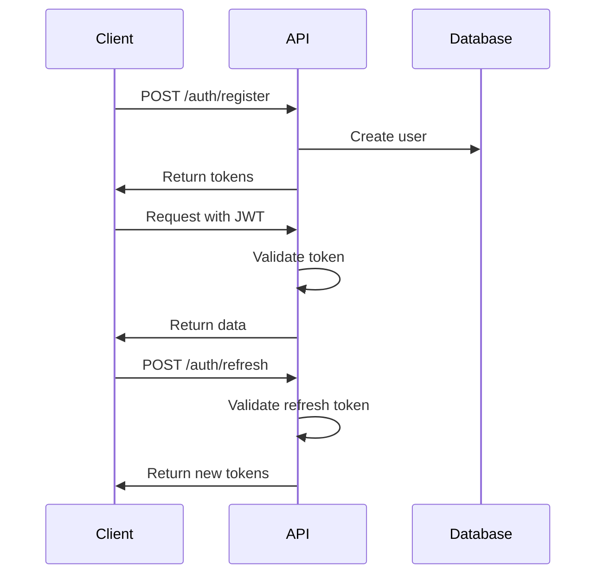

# Authentication API Reference

Complete guide to authentication endpoints and security implementation.

## Overview

The C++ Mastery Hub uses JWT-based authentication with refresh token rotation for secure access to protected resources.

## Authentication Flow



## Endpoints

### Register User

Create a new user account.

**Endpoint:** `POST /api/v1/auth/register`

**Request Body:**
```json
{
  "email": "user@example.com",
  "username": "johndoe",
  "password": "SecurePassword123!",
  "firstName": "John",
  "lastName": "Doe"
}
```

**Validation Rules:**
- Email: Valid email format, unique
- Username: 3-30 characters, alphanumeric + underscore, unique
- Password: Minimum 8 characters, at least 1 uppercase, 1 lowercase, 1 number, 1 special character
- FirstName/LastName: Optional, 1-50 characters

**Response:**
```json
{
  "success": true,
  "data": {
    "user": {
      "id": "cm1a2b3c4d5e6f7g8h9i0",
      "email": "user@example.com",
      "username": "johndoe",
      "firstName": "John",
      "lastName": "Doe",
      "role": "STUDENT",
      "createdAt": "2024-01-15T10:30:00Z"
    },
    "tokens": {
      "accessToken": "eyJhbGciOiJIUzI1NiIsInR5cCI6IkpXVCJ9...",
      "refreshToken": "eyJhbGciOiJIUzI1NiIsInR5cCI6IkpXVCJ9...",
      "expiresIn": 3600,
      "tokenType": "Bearer"
    }
  }
}
```

### Login User

Authenticate existing user.

**Endpoint:** `POST /api/v1/auth/login`

**Request Body:**
```json
{
  "email": "user@example.com",
  "password": "SecurePassword123!",
  "rememberMe": true
}
```

**Response:**
```json
{
  "success": true,
  "data": {
    "user": {
      "id": "cm1a2b3c4d5e6f7g8h9i0",
      "email": "user@example.com",
      "username": "johndoe",
      "role": "STUDENT",
      "lastLoginAt": "2024-01-15T10:30:00Z"
    },
    "tokens": {
      "accessToken": "eyJhbGciOiJIUzI1NiIsInR5cCI6IkpXVCJ9...",
      "refreshToken": "eyJhbGciOiJIUzI1NiIsInR5cCI6IkpXVCJ9...",
      "expiresIn": 3600,
      "tokenType": "Bearer"
    }
  }
}
```

### Refresh Token

Get new access token using refresh token.

**Endpoint:** `POST /api/v1/auth/refresh`

**Request Body:**
```json
{
  "refreshToken": "eyJhbGciOiJIUzI1NiIsInR5cCI6IkpXVCJ9..."
}
```

**Response:**
```json
{
  "success": true,
  "data": {
    "tokens": {
      "accessToken": "eyJhbGciOiJIUzI1NiIsInR5cCI6IkpXVCJ9...",
      "refreshToken": "eyJhbGciOiJIUzI1NiIsInR5cCI6IkpXVCJ9...",
      "expiresIn": 3600,
      "tokenType": "Bearer"
    }
  }
}
```

### Logout

Invalidate current session and tokens.

**Endpoint:** `POST /api/v1/auth/logout`

**Headers:**
```
Authorization: Bearer <access-token>
```

**Response:**
```json
{
  "success": true,
  "message": "Successfully logged out"
}
```

### Password Reset

Request password reset email.

**Endpoint:** `POST /api/v1/auth/forgot-password`

**Request Body:**
```json
{
  "email": "user@example.com"
}
```

**Response:**
```json
{
  "success": true,
  "message": "Password reset email sent"
}
```

### Reset Password

Reset password using token from email.

**Endpoint:** `POST /api/v1/auth/reset-password`

**Request Body:**
```json
{
  "token": "reset-token-from-email",
  "newPassword": "NewSecurePassword123!"
}
```

**Response:**
```json
{
  "success": true,
  "message": "Password reset successfully"
}
```

## Security Features

### Token Structure

**Access Token Payload:**
```json
{
  "userId": "cm1a2b3c4d5e6f7g8h9i0",
  "email": "user@example.com",
  "role": "STUDENT",
  "sessionId": "session-uuid",
  "iat": 1642248600,
  "exp": 1642252200
}
```

**Refresh Token Payload:**
```json
{
  "userId": "cm1a2b3c4d5e6f7g8h9i0",
  "sessionId": "session-uuid",
  "tokenVersion": 1,
  "iat": 1642248600,
  "exp": 1642853400
}
```

### Security Measures

1. **Password Hashing**: bcrypt with 12 rounds
2. **JWT Signing**: HMAC SHA-256 algorithm
3. **Token Rotation**: Refresh tokens are rotated on each use
4. **Session Management**: Server-side session tracking
5. **Rate Limiting**: Protection against brute force attacks
6. **Account Lockout**: Temporary lockout after failed attempts

### Error Responses

**Invalid Credentials:**
```json
{
  "success": false,
  "error": "Invalid email or password"
}
```

**Validation Error:**
```json
{
  "success": false,
  "error": "Validation failed",
  "errors": [
    {
      "field": "password",
      "message": "Password must contain at least one uppercase letter",
      "code": "INVALID_FORMAT"
    }
  ]
}
```

**Token Expired:**
```json
{
  "success": false,
  "error": "Access token has expired"
}
```