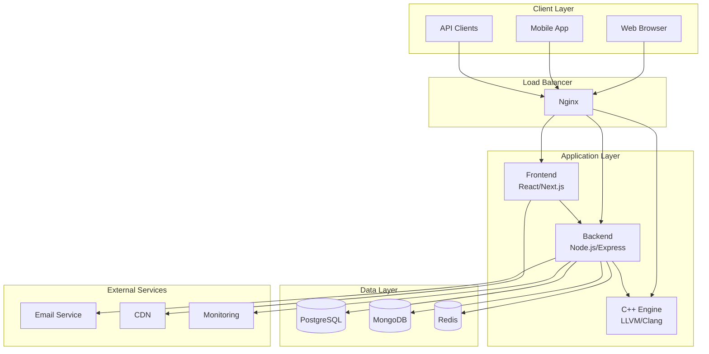
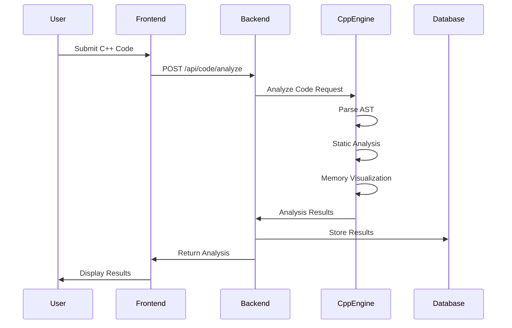
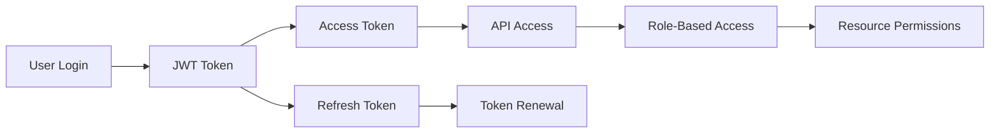
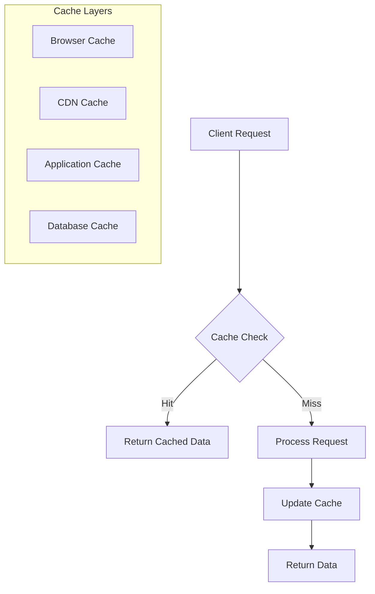
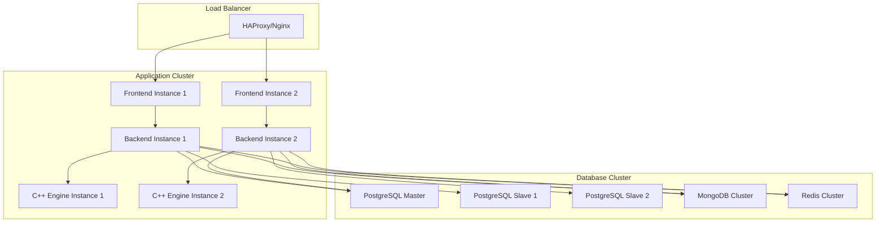

# C++ Mastery Hub Architecture

This document provides a comprehensive overview of the C++ Mastery Hub architecture, design decisions, and system components.

## 🏗️ High-Level Architecture

## 🧩 System Components

### Frontend (React/TypeScript/Next.js)
- **Purpose**: User interface and experience
- **Technology**: React 18, TypeScript, Next.js 14, Tailwind CSS
- **Key Features**:
  - Server-side rendering for SEO and performance
  - Progressive Web App capabilities
  - Real-time updates via WebSocket
  - Code editor with Monaco Editor
  - Memory visualization components
  - Responsive design for all devices

### Backend (Node.js/Express/TypeScript)
- **Purpose**: API server, business logic, authentication
- **Technology**: Node.js, Express, TypeScript, Prisma ORM
- **Key Features**:
  - RESTful API with OpenAPI documentation
  - JWT-based authentication with refresh tokens
  - Real-time communication via Socket.io
  - Rate limiting and security middleware
  - Comprehensive logging and monitoring
  - Background job processing

### C++ Analysis Engine (C++/LLVM/Clang)
- **Purpose**: Code analysis, compilation, and execution
- **Technology**: Modern C++20, LLVM 17, Clang, CMake
- **Key Features**:
  - LLVM/Clang integration for AST parsing
  - Static analysis with security vulnerability detection
  - Memory visualization and profiling
  - Secure sandboxed code execution
  - Performance metrics collection
  - HTTP API for integration

### Database Layer
- **PostgreSQL**: Primary database for structured data
- **MongoDB**: Document storage for flexible content
- **Redis**: Caching, sessions, and real-time data

## 🔄 Data Flow Architecture

## 🏛️ Design Patterns & Principles

### Architecture Patterns
- **Microservices**: Loosely coupled services with clear boundaries
- **Event-Driven**: Asynchronous communication via events
- **CQRS**: Command Query Responsibility Segregation for complex operations
- **API Gateway**: Single entry point with routing and authentication

### Design Patterns
- **Repository Pattern**: Data access abstraction
- **Factory Pattern**: Object creation for different analyzers
- **Observer Pattern**: Real-time updates and notifications
- **Strategy Pattern**: Pluggable analysis algorithms
- **Decorator Pattern**: Enhancement of core functionalities

### SOLID Principles
- **Single Responsibility**: Each class has one reason to change
- **Open/Closed**: Open for extension, closed for modification
- **Liskov Substitution**: Subtypes must be substitutable
- **Interface Segregation**: Many specific interfaces vs one general
- **Dependency Inversion**: Depend on abstractions, not concretions

## 🔐 Security Architecture

### Authentication & Authorization

### Security Measures
- **JWT Authentication**: Stateless token-based authentication
- **Role-Based Access Control**: Granular permissions system
- **Code Sandboxing**: Isolated execution environment
- **Input Validation**: Comprehensive sanitization
- **Rate Limiting**: DDoS protection and resource management
- **HTTPS Everywhere**: End-to-end encryption
- **Security Headers**: CORS, CSP, HSTS implementation

## 📊 Performance Architecture

### Caching Strategy

### Performance Optimizations
- **Multi-level Caching**: Browser, CDN, Application, Database
- **Code Splitting**: Lazy loading of frontend components
- **Database Indexing**: Optimized query performance
- **Connection Pooling**: Efficient database connections
- **Horizontal Scaling**: Load distribution across instances
- **Asset Optimization**: Minification, compression, bundling

## 🔄 Deployment Architecture

### Production Environment

### Deployment Pipeline
- **CI/CD Integration**: Automated testing and deployment
- **Blue-Green Deployment**: Zero-downtime deployments
- **Container Orchestration**: Docker with Kubernetes
- **Infrastructure as Code**: Terraform for provisioning
- **Monitoring & Alerting**: Comprehensive observability

## 🏗️ Scalability Considerations

### Horizontal Scaling
- **Stateless Services**: Enable easy scaling across instances
- **Load Balancing**: Distribute traffic efficiently
- **Database Sharding**: Partition data across multiple nodes
- **Microservices**: Independent scaling of components

### Vertical Scaling
- **Resource Optimization**: CPU and memory tuning
- **Database Optimization**: Query optimization and indexing
- **Caching Strategies**: Reduce computational overhead
- **Algorithm Efficiency**: Optimized code analysis algorithms

## 🔍 Monitoring & Observability

### Metrics Collection
- **Application Metrics**: Response times, throughput, errors
- **Infrastructure Metrics**: CPU, memory, disk, network
- **Business Metrics**: User engagement, feature usage
- **Security Metrics**: Authentication failures, access patterns

### Logging Strategy
- **Structured Logging**: JSON format for easy parsing
- **Centralized Logging**: ELK stack for log aggregation
- **Log Levels**: DEBUG, INFO, WARN, ERROR, FATAL
- **Correlation IDs**: Track requests across services

### Alerting System
- **Real-time Alerts**: Critical system issues
- **Threshold Monitoring**: Performance degradation
- **Trend Analysis**: Capacity planning and optimization
- **Incident Response**: Automated escalation procedures

## 🚀 Future Architecture Considerations

### Planned Enhancements
- **Machine Learning Integration**: AI-powered code suggestions
- **GraphQL API**: More efficient data fetching
- **Event Sourcing**: Complete audit trail of changes
- **Serverless Functions**: Cost-effective scaling for specific tasks
- **Edge Computing**: Reduced latency for global users

### Technology Evolution
- **WebAssembly**: Client-side C++ execution
- **Kubernetes**: Container orchestration migration
- **Service Mesh**: Enhanced service communication
- **Blockchain**: Certification and achievement tracking
- **AR/VR**: Immersive learning experiences

This architecture provides a solid foundation for the C++ Mastery Hub while maintaining flexibility for future enhancements and scaling requirements.