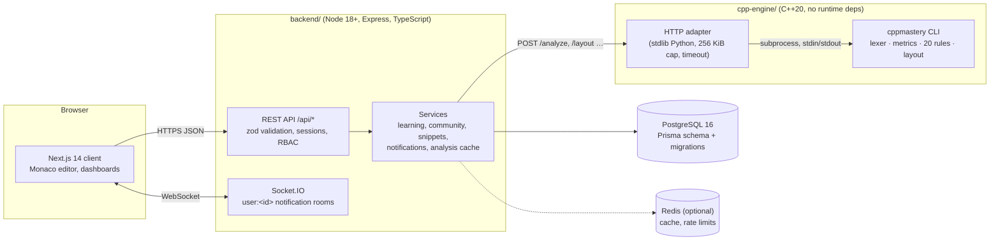

# Architecture

C++ Mastery Hub has three deployable parts and two data stores. The design rule that shapes
everything else: **learner-submitted code is analysed, never executed**, until a sandbox that
meets the threat model exists (ADR-0005, `docs/research/threat-model.md`).

```mermaid
flowchart LR
    subgraph Browser
        UI["Next.js 14 client<br/>Monaco editor, dashboards"]
    end

    subgraph Backend["backend/ (Node 18+, Express, TypeScript)"]
        API["REST API /api/*<br/>zod validation, sessions, RBAC"]
        RT["Socket.IO<br/>user:&lt;id&gt; notification rooms"]
        SVC["Services<br/>learning, community, snippets,<br/>notifications, analysis cache"]
    end

    subgraph Engine["cpp-engine/ (C++20, no runtime deps)"]
        AD["HTTP adapter<br/>(stdlib Python, 256 KiB cap, timeout)"]
        CLI["cppmastery CLI<br/>lexer · metrics · 20 rules · layout"]
    end

    PG[("PostgreSQL 16<br/>Prisma schema + migrations")]
    RD[("Redis (optional)<br/>cache, rate limits")]

    UI -- "HTTPS JSON" --> API
    UI <-- "WebSocket" --> RT
    API --> SVC
    SVC --> PG
    SVC -.-> RD
    SVC -- "POST /analyze, /layout …" --> AD
    AD -- "subprocess, stdin/stdout" --> CLI
```

## Components

### Analysis engine (`cpp-engine/`)

A C++20 static library plus CLI with no third-party runtime dependencies. A total lexer feeds
classical metrics (Halstead, McCabe, Maintainability Index), a rule engine whose 20 rules each
cite a guideline, and a struct-layout model with a provably optimal reordering. Output is
versioned JSON validated by JSON Schema. The HTTP adapter is a thin, stateless wrapper that
spawns the CLI per request with a size cap and timeout; it is the only network-facing piece of
the engine and it never compiles or runs input. Details: `cpp-engine/README.md`,
`docs/research/`.

### Backend (`backend/`)

`src/app.ts` builds the Express application (used directly by the tests); `src/server.ts` adds
the database connection, optional Redis, Socket.IO and graceful shutdown.

| Layer | Location | Responsibility |
|---|---|---|
| Routes | `src/api/routes/*.ts` | Parse and validate input with zod, call a service, shape the response |
| Middleware | `src/api/middleware/` | Session-bound JWT auth, role checks, rate limits, error mapping |
| Services | `src/services/` | Domain logic: sessions, learning, snippets, notifications, engine client |
| Data | `prisma/schema.prisma` | 26 models; migrations in `prisma/migrations/`; idempotent seed |

Sessions are rows in `user_sessions`: an access token is valid only while its row is active,
which makes logout, password change and bans effective immediately. Refresh tokens rotate on
use and reuse revokes every session of the user.

Pure, deterministic logic (quiz grading, course recommendation ranking, cache keys) lives in
dependency-free modules so it can be unit-tested without a database.

### Frontend (`frontend/`)

Next.js 14 (pages router) with Tailwind. `src/services/api.ts` is a typed client whose paths
mirror `docs/api/README.md`; `src/types/index.ts` mirrors the backend's response shapes. Monaco
is loaded at runtime with `@monaco-editor/loader` because its ESM build imports CSS that
Next.js cannot bundle. Features the backend does not provide (live collaboration, OAuth) are
behind explicit `NEXT_PUBLIC_ENABLE_*` flags that default to off.

## Request lifecycle: analysing code

1. The editor posts `{code}` to `POST /api/analysis/analyze`.
2. The route validates size and options; the analysis service hashes `(endpoint, code,
   options)` and returns a cached report if present.
3. Otherwise the engine client posts to the adapter, which runs
   `cppmastery analyze --json --fail-on never -` with a timeout and returns the report.
4. Transport failures map to 503 (unreachable) or 504 (timeout); adapter 4xx errors pass
   through; the report is cached for an hour (results depend only on input and engine version).

## Deployment

`docker-compose.yml` runs the full stack locally with production-like settings; the engine
container has a read-only root filesystem, drops all capabilities and runs as an unprivileged
user. `docker-compose.prod.yml` uses the images CI publishes to GHCR. The engine image runs its
entire test suite and evaluation during `docker build`, so an image that exists has passed.

## Quality gates

| Gate | Where |
|---|---|
| Engine: GCC 12/13, Clang 18, AppleClang builds; 70 tests; ASan+UBSan; clang-tidy; clang-format; libFuzzer smoke; evaluation | `.github/workflows/engine.yml` |
| Backend: strict `tsc`, ESLint, 64 unit/integration/contract tests, production build | `.github/workflows/web.yml` (backend) |
| Backend end-to-end on PostgreSQL 16 with the real engine; schema-drift check | `.github/workflows/web.yml` (e2e) |
| Frontend: strict `tsc`, `next lint`, 25 tests, production build | `.github/workflows/web.yml` (frontend) |
| CodeQL (C/C++, JavaScript/TypeScript) | `.github/workflows/codeql.yml` |
| Engine image build + smoke test, GHCR publish | `.github/workflows/docker.yml` |

Decisions behind this structure are recorded in `docs/adr/`.
